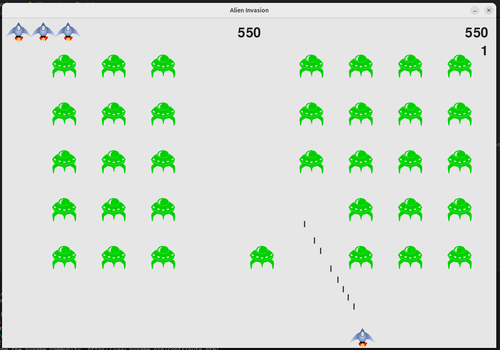

# Alien Invaders

Alien Invaders es un clon del clásico juego Space Invaders, desarrollado en Python utilizando la biblioteca Pygame. Dispara a los invasores espaciales y protege la Tierra en este desafiante juego arcade.

## Características
- Gráficos y animaciones en 2D con Pygame.
- Movimiento fluido de la nave y los enemigos.
- Disparos y colisiones implementadas.
- Sistema de puntuación.

## Requisitos
Asegúrate de tener Python instalado en tu sistema. Luego, instala las dependencias necesarias:
```bash
pip install pygame
```

## Instalación y Ejecución
Clona este repositorio y ejecuta el juego:
```bash
git clone [https://github.com/franciscapr/alien_invaders.git]
cd alien_invaders
```

## Controles
- **Flechas Izquierda/Derecha**: Mover la nave.
- **Espacio**: Disparar.

## Capturas de Pantalla



